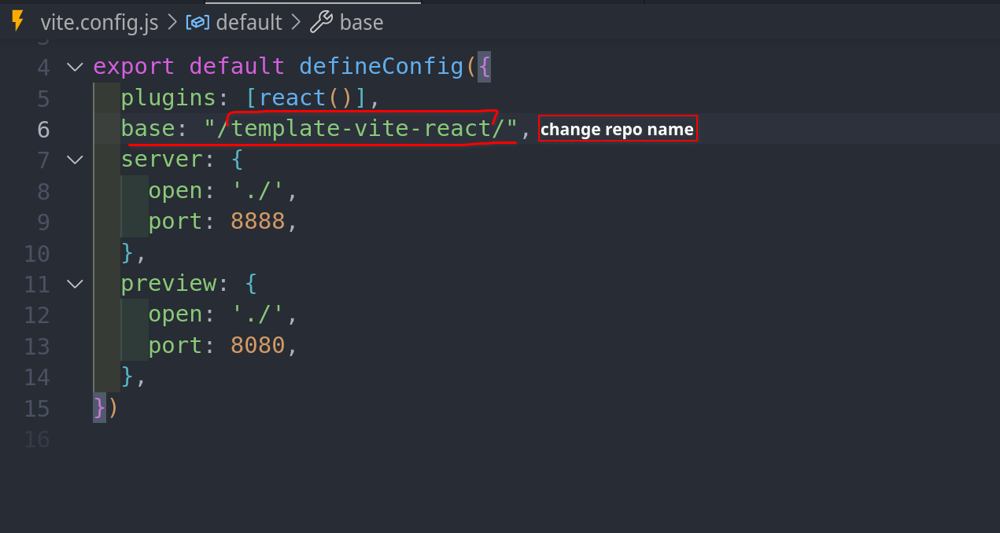
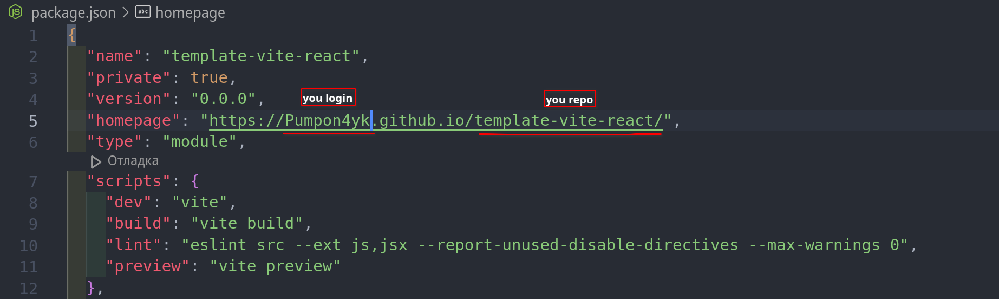

# template-vite-react

# Seting project

# Change

# Deploy 
The production version of the project will automatically be linted, built, and deployed to GitHub Pages, in the gh-pages branch, every time the
main branch is updated. For example, after a direct push or an accepted pull request. To do this, you need to edit the homepage field in the
package.json file, replacing your_username and your_repo_name with your own, and submit the changes to GitHub. 
json "homepage": "https://your_username.github.io/your_repo_name/" 
Next, you need to go to the settings of the GitHub repository (Settings > Pages) and set the distribution of the production version of files from
the /root folder of the gh-pages branch, if this was not done automatically. 

Make sure you have an LTS version of Node.js installed on your computer. Download and install if needed.
Install the project's base dependencies with the npm install command.
Start development mode by running the npm start command.
Go to http://localhost:8888 in your browser. This page will automatically reload after saving changes to the project files. 

# Routing 

If your application uses the react-router-dom library for routing, you must additionally configure the <BrowserRouter> component by
passing the exact name of your repository in the basename prop. Slashes at the beginning and end of the line are required. 
jsx <BrowserRouter basename="/your_repo_name/"> <App /> </BrowserRouter> 

# How it works 

After each push to the main branch of the GitHub repository, a special script (GitHub Action) is launched from the .github/workflowsdeploy.yml file.
All repository files are copied to the server, where the project is initialized and linted and built before deployment.
If all steps are successful, the built production version of the project files is sent to the gh-pages branch. Otherwise, the script execution
log will indicate what the problem is.